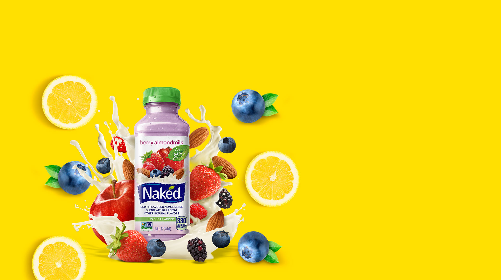

<div align="center">

  

  <h1>Biolife</h1>
  <p><strong>Organic food e-commerce on ASP.NET Core MVC</strong></p>

  

  <p>
    
    
    
  </p>

  

</div>

---

## ✨ About The Project

**Biolife** is an educational organic food e-commerce project with a lively storefront design: sliders, product cards, categories, authentication, an admin panel, and CRUD sections for content management.

The visual style is built around a fresh green palette, fruit banners, soft promo blocks, and dynamic UI elements from the original Biolife template.

<p align="center">
  
  
  
</p>

## 🧩 Features

- 🛒 Storefront with a home page, promo sections, and a product showcase.
- 🔐 Cookie authentication, roles, sessions, and middleware for user validation.
- 🌐 Google external login when `Authentication:Google` is available in the local configuration.
- 🧑‍💼 Admin panel for users, roles, products, genres, authors, notes, and carousel content.
- 🗄️ Entity Framework Core + SQL Server + migrations.
- 🖼️ Image uploads through `wwwroot/uploads` as runtime storage.
- ✉️ Email service abstractions for email confirmation and password recovery.

## 🏗️ Architecture

```text
Biolife
├── .NET/Biolife
│   ├── Biolife.Web             # ASP.NET Core MVC, views, controllers, static files
│   ├── Biolife.Application     # ViewModels and application abstractions
│   ├── Biolife.Domain          # Domain entities
│   ├── Biolife.Persistence     # DbContext and EF Core migrations
│   └── Biolife.Infrastructure  # Services, email, auth/session middleware
├── assets                      # Original frontend template assets
└── index.html                  # Static source template
```

## 🚀 Getting Started

1. Install **.NET 10 SDK** and **SQL Server**.
2. Create a local `appsettings.json` inside `.NET/Biolife/Biolife.Web`.
3. Add the connection string and secrets locally only.
4. Run the application:

```bash
cd .NET/Biolife
dotnet restore
dotnet run --project Biolife.Web
```

The application automatically applies EF Core migrations on startup.

## 🔒 Security

`.gitignore` intentionally excludes local configuration and secrets:

- `appsettings.json`
- `appsettings.*.json`
- `.env`, `.env.*`
- `*.key`, `*.pem`, `*.pfx`, `secrets.json`
- build output: `bin/`, `obj/`, `artifacts/`
- IDE/runtime noise: `.vs/`, `*.log`, `devserver*.log`

For configuration examples, prefer safe files such as `appsettings.Example.json` without real keys.

## 🌿 Technologies

<p>
  
  
  
  
  
</p>

---

<div align="center">
  <sub>Fresh code. Clean config. No leaked secrets.</sub>
</div>
